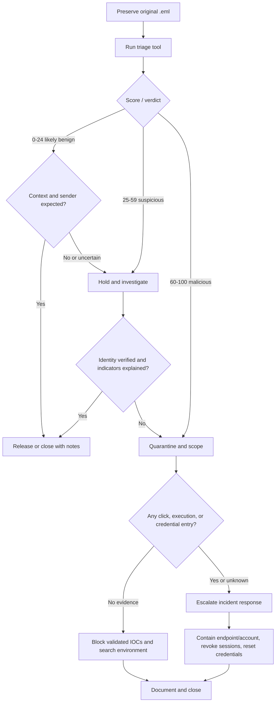

# Phishing Triage Decision Playbook

This playbook pairs with `phishing_triage.py`. The tool collects and scores evidence; the analyst owns the decision.

## Decision tree

## 1. Preserve and scope

1. Preserve the original message as `.eml`; do not forward it inline because forwarding can alter headers.
2. Record the reporting user, mailbox, receipt time, message ID, and ticket/case number.
3. Work from a controlled analyst environment. Do not click links or open attachments on a normal workstation.
4. Run the tool and attach its Markdown or JSON output to the case.

## 2. Validate identity and delivery evidence

Review the fields as a set rather than treating any single field as conclusive:

- Compare the display name and `From` address with the claimed identity.
- Investigate `Reply-To` and `Return-Path` differences. Marketing platforms and ticketing systems can create legitimate differences.
- Review SPF, DKIM, and DMARC results and their alignment. Authentication can pass for attacker-controlled domains.
- Inspect the `Received` chain in the original message if routing details matter; this demo does not score that chain.
- Determine whether the message was expected and whether the request matches normal business process.

## 3. Evaluate content and indicators

- Treat urgency, secrecy, credential prompts, payment changes, QR codes, and unexpected attachments as contextual signals.
- Never assume `not_found`, zero detections, or an unavailable API means safe. Newly registered infrastructure often has no reputation.
- Confirm that VirusTotal results are recent and refer to the exact URL/domain. Avoid submitting private URLs unless policy explicitly permits it.
- Check whether the visible link text and actual destination disagree using a safe analysis method.
- Search mail telemetry for the sender, subject, message ID, URLs, and recipient set.

## 4. Decide and respond

### Likely benign (0–24)

- Confirm the sender/context is expected and that no contradictory evidence exists.
- Release or close, documenting why the message is acceptable.
- Escalate instead if the user interacted or business context remains unclear.

### Suspicious (25–59)

- Keep the message held or quarantined.
- Validate the request with the claimed sender over a trusted, separate channel.
- Review domain age/reputation, URL path, related messages, and endpoint/network telemetry.
- Promote to malicious if identity cannot be verified or additional evidence confirms abuse.

### Malicious (60–100)

- Quarantine matching messages and identify all recipients.
- Block confirmed malicious indicators after checking for operational impact.
- Search proxy, DNS, identity, email, and EDR data for interaction.
- Preserve evidence and notify the incident-response owner.

## 5. Interaction-response checklist

If a recipient clicked, executed content, entered credentials, approved MFA, or the interaction state is unknown:

- Isolate affected endpoints when execution or payload delivery is possible.
- Reset compromised credentials and revoke active sessions/tokens.
- Review MFA methods, forwarding rules, mailbox delegates, and OAuth grants.
- Hunt for sign-ins, persistence, lateral movement, data access, and additional targets.
- Follow breach, legal, HR, and notification procedures appropriate to the organization.

## 6. Closure evidence

Record the final disposition, supporting evidence, affected users/assets, containment actions, indicators, timestamps, owner, and any tuning recommendation. Preserve the original message and a hash if required by evidence-handling policy.

## Analyst guardrails

- Do not visit a suspicious URL directly.
- Do not paste secrets, private URLs, or personal data into public analysis services.
- Do not block a shared hosting/CDN domain solely because one URL is malicious.
- Do not use the score as the only basis for disciplinary, legal, or high-impact action.
