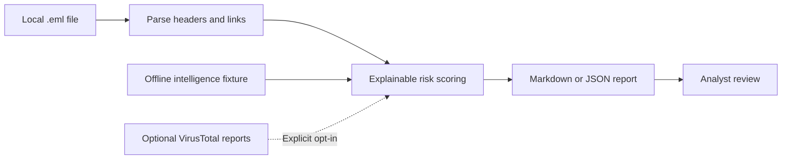

# Automated Phishing Triage Toolkit

A dependency-free Python CLI that turns a raw email (`.eml`) into an analyst-friendly phishing triage summary. It parses identity and authentication headers, extracts links without visiting them, enriches URL/domain indicators with VirusTotal, applies transparent scoring rules, and exports Markdown or JSON.

> This is a portfolio and analyst-assistance tool, not an autonomous email security gateway. An analyst should validate every verdict in context.

## Project overview

| Focus | Evidence | Scope |
| --- | --- | --- |
| Parse suspicious email and explain the triage decision | [Synthetic report](samples/reports/credential-harvest.md) · [Analyst playbook](PLAYBOOK.md) | Local parsing; live reputation lookups require explicit opt-in |

### Workflow



The offline fixture is fictional. The toolkit does not visit extracted links or execute attachments.

## Synthetic terminal example

Run the included credential-harvest message with the offline, fictional intelligence fixture. This performs no network lookups. The excerpt below is from the real CLI output; message identifiers and indicators are omitted.

```text
$ python phishing_triage.py samples/emails/credential-harvest.eml --intel-file samples/demo-intel.json
# Phishing Triage Summary
- **Verdict:** MALICIOUS
- **Risk score:** 100/100
## Authentication
| Control | Result |
|---|---|
| SPF | FAIL |
| DKIM | FAIL |
| DMARC | FAIL |
```

## What it demonstrates

- RFC 5322 and MIME parsing with Python's standard library
- Header analysis: `From`, `Reply-To`, `Return-Path`, `Authentication-Results`, and `Received-SPF`
- URL extraction from plain text and HTML links while ignoring attachments
- VirusTotal API v3 enrichment for domain and URL reports
- Explainable risk scoring and response recommendations
- Safe Markdown output with defanged indicators
- Deterministic offline demonstrations and automated tests

## Quick start

Python 3.10+ is required. No third-party packages are needed.

```bash
git clone https://github.com/jfrance167/automated-phishing-triage-toolkit.git
cd automated-phishing-triage-toolkit

# Parse and score locally (no network requests, even when VT_API_KEY is set)
python phishing_triage.py samples/emails/credential-harvest.eml

# Reproduce the sanitized demo with fixture intelligence
python phishing_triage.py samples/emails/credential-harvest.eml \
  --intel-file samples/demo-intel.json

# Generate JSON for a SIEM/SOAR pipeline
python phishing_triage.py message.eml --format json --output report.json
```

## VirusTotal enrichment

Create a VirusTotal API key, store it in an environment variable, and run the tool. Never commit the key.

PowerShell:

```powershell
$env:VT_API_KEY = "your-api-key"
# Live domain-only lookups (domains are the default)
python .\phishing_triage.py .\message.eml --online-enrichment --request-delay 16 --output .\triage.md
# Full URL lookups disclose paths and query strings; approve them for this run
python .\phishing_triage.py .\message.eml --online-enrichment --lookup urls --allow-url-disclosure --request-delay 16 --output .\triage.md
```

Bash:

```bash
export VT_API_KEY="your-api-key"
python phishing_triage.py message.eml --online-enrichment --request-delay 16 --output triage.md
```

Live lookups are disabled by default, even when `VT_API_KEY` or `--api-key` is present. `--online-enrichment` is required for every online request. Domain-only lookup is the default. Complete URL lookup additionally requires `--lookup urls` (or `both`) and the per-run `--allow-url-disclosure` flag because paths and query strings may contain credentials or victim-specific tokens.

The client uses VirusTotal API v3's domain endpoint and the URL endpoint with an unpadded URL-safe Base64 identifier. `--request-delay` is configurable because quota and rate limits vary by account. A 404 becomes `not_found`; other API/network failures are recorded as `error` and do not crash the entire investigation. `--online-enrichment` requires an API key through `--api-key` or `VT_API_KEY`. `--intel-file` always takes precedence and stays offline, even when online enrichment is requested.

The tool only requests existing reports. It does **not** submit unknown URLs for scanning, because submission may disclose sensitive tokens, internal hostnames, or victim-specific data to a third party. Review your organization's data-handling policy before enabling lookups on real messages. Email inputs are read with a 25 MiB cap.

## Verdict model

The score is capped at 100. Every point is shown as a finding in the report.

| Signal | Points |
|---|---:|
| Reply-To domain differs from From | 15 |
| Return-Path domain differs from From | 10 |
| SPF or DKIM fail/softfail/permerror | 10 each |
| DMARC fail/softfail/permerror | 15 |
| Raw IP address in a URL | 20 |
| Punycode domain in a URL | 15 |
| User-info (`user@host`) in a URL | 20 |
| Unencrypted HTTP URL | 3 |
| VirusTotal: 1+ malicious or 2+ suspicious engines | 35 |
| VirusTotal: 3+ malicious engines | 60 |

| Score | Verdict | Default response |
|---:|---|---|
| 0–24 | Likely benign | Validate and close/release |
| 25–59 | Suspicious | Hold and investigate |
| 60–100 | Malicious | Quarantine, scope, contain, and preserve |

These thresholds are intentionally readable and conservative, but they are example policy. Tune them to your mail environment and risk appetite. Authentication alignment and message context can be more nuanced than simple domain equality.

## Sample evidence

- [`samples/reports/credential-harvest.md`](samples/reports/credential-harvest.md) — malicious credential-harvest scenario
- [`samples/reports/invoice-lure.md`](samples/reports/invoice-lure.md) — suspicious vendor/payment scenario
- [`samples/reports/benign-newsletter.json`](samples/reports/benign-newsletter.json) — likely-benign JSON output
- [`PLAYBOOK.md`](PLAYBOOK.md) — analyst decision tree and escalation checklist

All samples use reserved or documentation-only namespaces/addresses (`.example`, `example.org`, and `198.51.100.0/24`). The intelligence in `samples/demo-intel.json` is fictional and exists only to make the demo reproducible.

## CLI reference

```text
python phishing_triage.py EMAIL
  [--format markdown|json]
  [--output PATH]
  [--api-key KEY]
  [--intel-file PATH]
  [--lookup domains|urls|both]
  [--online-enrichment]
  [--allow-url-disclosure]
  [--request-delay SECONDS]
```

Prefer `VT_API_KEY` over `--api-key`, since command-line arguments may be captured in shell history or process listings. `--lookup` defaults to `domains`. `--intel-file` takes precedence over API keys and both online consent flags and is intended for demonstrations and tests.

## Test

```bash
python -m unittest discover -s tests -v
```

GitHub Actions runs the suite on Python 3.10 and 3.13.

## Limitations and next steps

- It does not open links, detonate attachments, resolve redirect chains, or submit indicators.
- It extracts only `http` and `https` URLs and does not recursively decode QR codes or nested archives.
- Domain comparison is exact rather than organizational-domain/PSL aware, avoiding an extra dependency but producing some legitimate third-party-sender findings.
- A production deployment should add secure evidence storage, organizational allowlists, case-management integration, and monitoring around API quotas.

## References

- [VirusTotal: Get a domain report](https://docs.virustotal.com/reference/domain-info)
- [VirusTotal: Get a URL report](https://docs.virustotal.com/reference/url-info)
- [Python `email` package documentation](https://docs.python.org/3/library/email.html)

## License

MIT — see [`LICENSE`](LICENSE).

## Repository map

```text
automated-phishing-triage-toolkit/
|-- .github/
|-- .gitignore
|-- LICENSE
|-- PLAYBOOK.md
|-- README.md
|-- SECURITY.md
|-- phishing_triage.py
|-- samples/
`-- tests/
```

Follow the setup and safety boundaries above before running or deploying any code.

